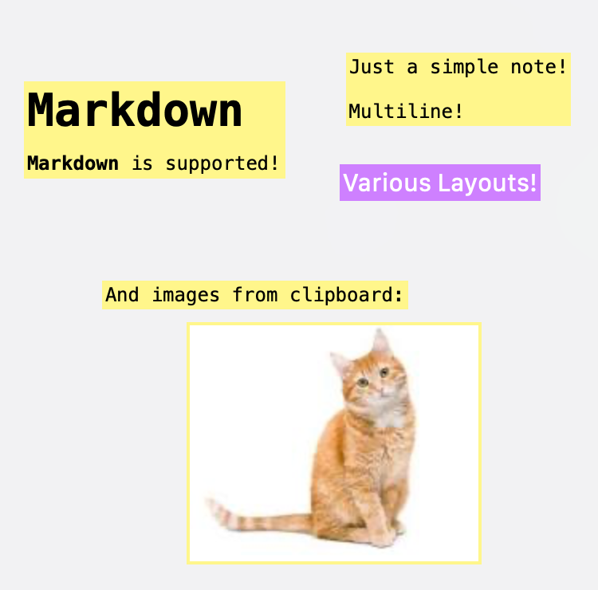
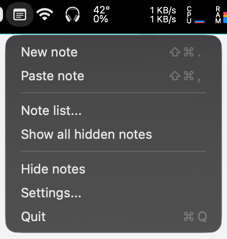
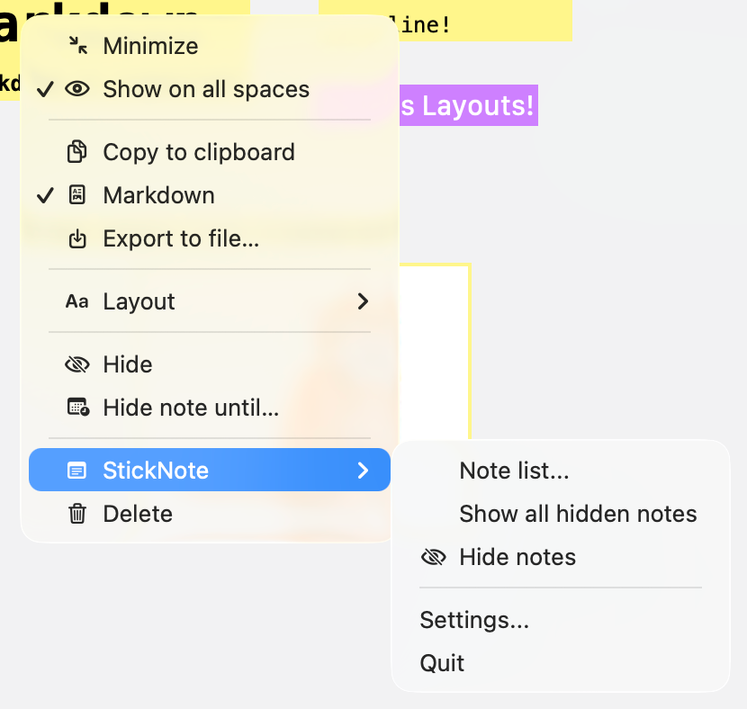

# StickNote

<p align="center">
  <a href="https://github.com/alex-fomin/StickNote/releases">
    
  </a>
</p>

**StickNote** is a macOS menu bar utility for lightweight floating sticky notes. Notes support Markdown rendering, optional image notes from the clipboard, per-note layouts, and are stored with **SwiftData**.

Prebuilt downloads: **[Releases](https://github.com/alex-fomin/StickNote/releases)**.

**Website:** [alex-fomin.github.io/StickNote](https://alex-fomin.github.io/StickNote/) — static site from the [`docs/`](docs/) folder (`index.html`, `site.css`, assets). Enable **Settings → Pages →** branch `main`, folder `/docs` if the site is not live yet.

## Screenshots

<p align="center">
  
  <br>
  <em>Floating notes — Markdown, multiline text, layouts, and images from the clipboard.</em>
</p>

<p align="center">
  
  <br>
  <em>Menu bar menu — global shortcuts are configurable in Settings.</em>
</p>

<p align="center">
  
  <br>
  <em>Per-note menu (minimize, spaces, Markdown, export, layout, hide, delete) and quick global actions.</em>
</p>

## Features

- **Menu bar presence** — quick actions from the status item (single-click toggles note visibility; double-click opens a new note).
- **Floating notes** — always-on-top windows with draggable chrome and optional “maximize on hover” / “maximize after edit” behavior.
- **Markdown** — notes render Markdown in the note view (via [Down](https://github.com/johnxnguyen/Down) and related text stack).
- **Note list** — browse notes, including hidden ones, from a dedicated window.
- **Layouts** — choose default layout presets for new notes (editable in Settings).
- **Clipboard** — create a note from a pasted image when the pasteboard contains suitable image data.
- **Configurable shortcuts** — record global shortcuts in **Settings → General** for new note, paste-from-clipboard note, and show/hide all notes.
- **Optional launch at login** and other behaviors (delete confirmation, trash vs permanent delete, “show on all spaces,” menubar note count, etc.) in **Settings**.

## Requirements

- **macOS** 15.0 or later (project `MACOSX_DEPLOYMENT_TARGET`).
- **Xcode** with Swift 5 and SwiftPM (for building from source).

## Building from source

1. Clone the repository:

   ```bash
   git clone https://github.com/alex-fomin/StickNote.git
   cd StickNote
   ```

2. Open `StickNote.xcodeproj` in Xcode and build the **StickNote** scheme, **or** build from the terminal:

   ```bash
   xcodebuild -project StickNote.xcodeproj -scheme StickNote -configuration Debug \
     -destination 'platform=macOS' -derivedDataPath .build build
   ```

3. Run the built app:

   ```bash
   open .build/Build/Products/Debug/StickNote.app
   ```

Swift package dependencies are resolved automatically via Xcode (see `StickNote.xcodeproj/project.xcworkspace/xcshareddata/swiftpm/Package.resolved`).

## Third-party software

StickNote is built with **Swift**, **SwiftUI**, **SwiftData**, and **AppKit** (subject to Apple’s SDK and developer terms). It links these **direct** Swift Package Manager dependencies (transitive packages are not listed):

| Package | License |
|--------|---------|
| [Defaults](https://github.com/sindresorhus/Defaults) | MIT |
| [Down](https://github.com/johnxnguyen/Down) | MIT (see upstream for bundled components) |
| [FontPicker](https://github.com/tyagishi/FontPicker) | MIT |
| [KeyboardShortcuts](https://github.com/sindresorhus/KeyboardShortcuts) | MIT |
| [LaunchAtLogin-Modern](https://github.com/sindresorhus/LaunchAtLogin-Modern) | MIT |
| [MenuBarExtraAccess](https://github.com/orchetect/MenuBarExtraAccess) | MIT |
| [Textual](https://github.com/gonzalezreal/textual) | MIT |

**Full attribution** (pinned versions, links to upstream license files, and an Apple tools note): [`StickNote/ThirdPartyNotices.md`](StickNote/ThirdPartyNotices.md). The same text is available in the app under **Settings → About → Third-party licenses…**.

## License

[MIT](LICENSE) — Copyright © 2025–2026 Alex Fomin.
